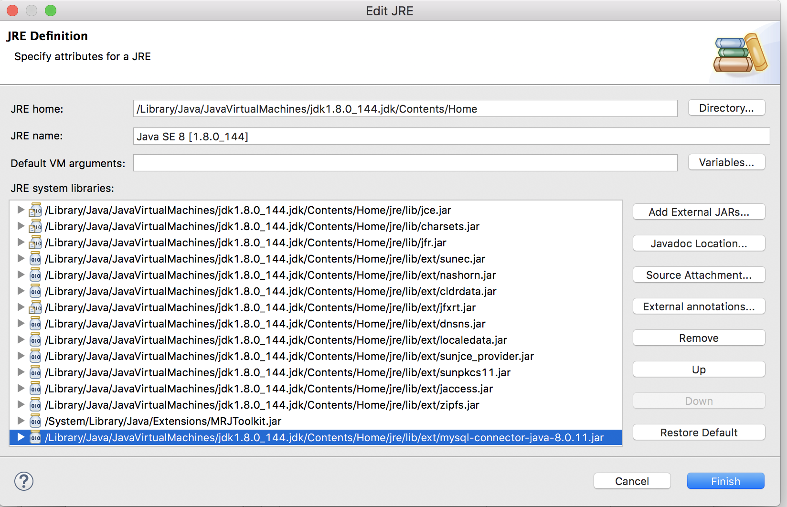
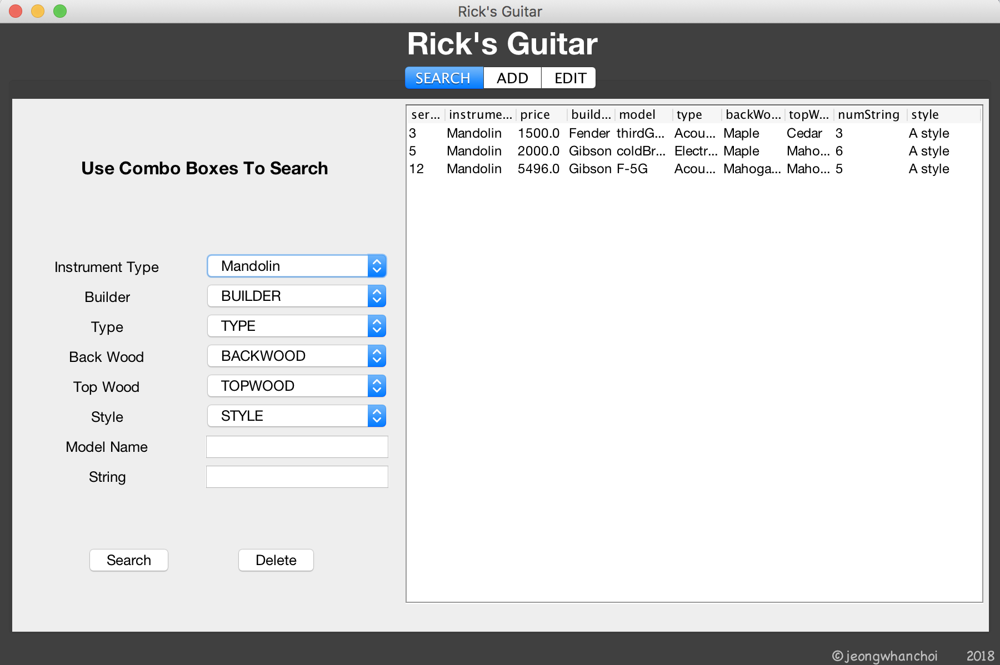
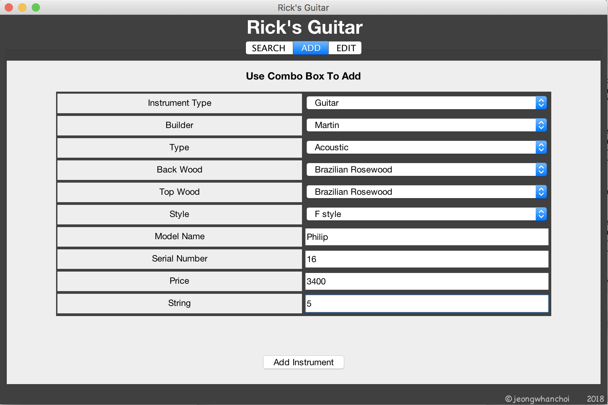
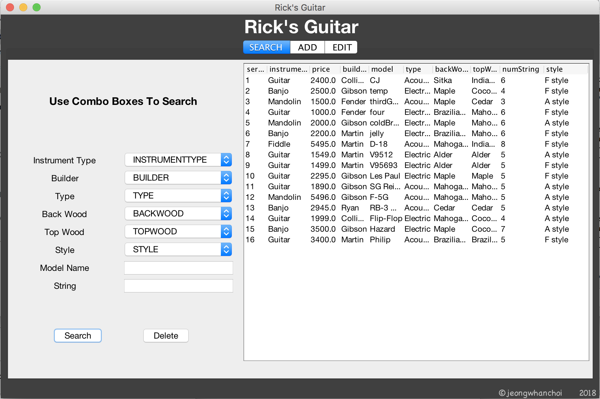
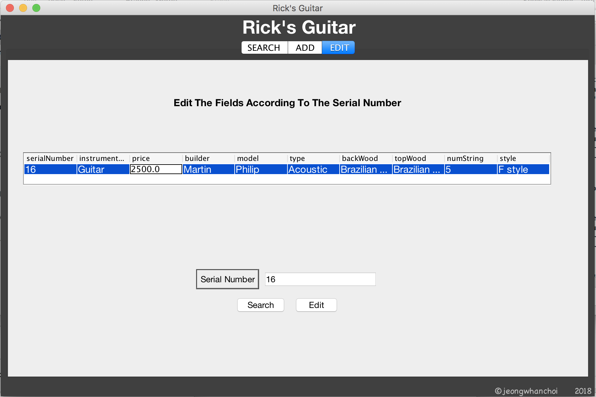
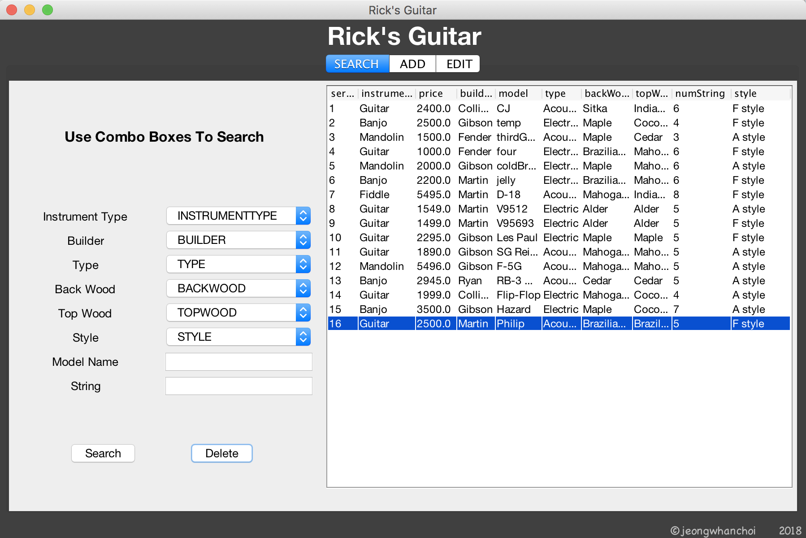
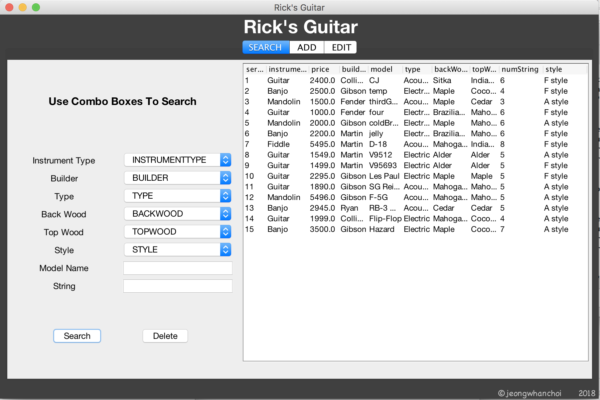

# Rick's Guitar App

## Environment

- JavaSE-1.8 
  - jdk1.8.0_144  
- MySQL 8.0.11
- mysql-connector-java-8.0.11
- MySQL Workbench 6.3
- Eclipse IDE for Java Developers
  - Version: Oxygen.3a Release (4.7.3a)

### MySQL JDBC Connector

[Download](https://dev.mysql.com/downloads/connector/j/)

#### MacOS


#### Add External JAR

After download Connector Archive, you can find the `mysql-connector-java-8.0.11.jar` file below.


Add this JAR file to the JRE system libraries via the `Add External JARs...` button. 



### .properties

You need to create the `config.properties` file like below to connect your MySQL server.

```properties
user=root
password=0000
dburl=jdbc:mysql://localhost:3306/ricksGuitar?autoReconnect=true&useSSL=false&useLegacyDatetimeCode=true&serverTimezone=Asia/Seoul
```

## Screen Shots

### Search


### Detail Search



### Add





### Edit




### Delete






